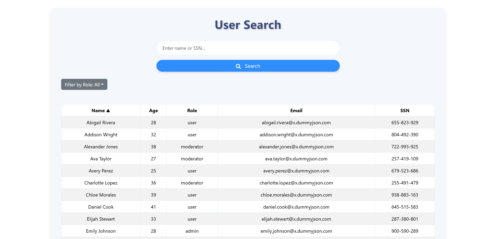

# User Search Application

This project consists of two parts: a React-based frontend for searching, filtering, and sorting user data, and a Spring Boot backend for importing and retrieving user data. Below are the details for setting up and using both components.

---

## Frontend - React User Search

## Features

- **Search:**  
  Search for users by name or SSN using an input field.

- **Filter by Role:**  
  Filter users based on their roles (Admin, User, Moderator, or All).

- **Sorting:**  
  Sort users by columns (Name, Age, Role, Email, SSN) in ascending or descending order.

- **Responsive Design:**  
  Fully responsive and styled using Bootstrap for a clean and modern look.

## Technologies Used

- **React:**  
  Core library for building the user interface.

- **React-Bootstrap:**  
  For styling and responsive design.

- **Axios:**  
  For making API requests.

- **React Icons:**  
  To enhance the UI with icons.

## Getting Started

### Prerequisites
Make sure you have the following installed on your system:

- Node.js (>=14.x)
- npm (>=6.x)

### Installation

1. Navigate to the project directory and install the dependencies:
    ```bash
    npm install
    ```

2. Start the development server:
    ```bash
    npm start
    ```

3. Open the application in your browser at [http://localhost:3000](http://localhost:3000).

## API Endpoint
The application communicates with the backend through the following API:

- **GET** `http://localhost:8080/api/users/search`
  - **Parameters:**
    - `query` (string): The search term for querying users.
  - **Response:**
    ```json
    [
      {
        "id": 1,
        "firstName": "John",
        "lastName": "Doe",
        "age": 30,
        "role": "admin",
        "email": "john.doe@example.com",
        "ssn": "123-45-6789"
      }
    ]
    ```

## Screenshots




## Backend - Spring Boot User API

# User API

A Spring Boot application for importing, searching, and retrieving user data. This application connects to an external JSON API (https://dummyjson.com/users) to import user data, stores it in an in-memory H2 database, and exposes RESTful endpoints for searching and retrieving users.

## Features

- Import users from a remote JSON API.
- Free Search users by partial first name, last name, or SSN.
- Retrieve a user by their ID or email.
- Database integration with H2 (in-memory database for development).
- Swagger UI for API documentation.

## Technologies Used

- **Spring Boot**: Backend framework.
- **Spring Data JPA**: ORM for interacting with the database.
- **H2 Database**: In-memory database for development and testing.
- **RestTemplate**: For making HTTP requests to external APIs.
- **Jackson**: JSON processing.
- **Lombok**: Reduces boilerplate code for model classes.

## Endpoints

### 1. **POST `/api/users/import`**
- Imports user data from a remote JSON API (https://dummyjson.com/users) and saves it to the database.
- **Response**:
  - `200 OK`: Users imported successfully.
  - `500 Internal Server Error`: Failed to import users.

### 2. **GET `/api/users/search`**
- Searches users by a partial match of their first name, last name, or SSN.
- **Request Parameters**:
  - `query`: The search term (string).
- **Response**:
  - `200 OK`: A list of users matching the search query.
  - `400 Bad Request`: Invalid or missing query parameter.

### 3. **GET `/api/users/find`**
- Retrieves a user by their ID or email.
- **Request Parameters**:
  - `id` (optional): User's unique identifier (Long).
  - `email` (optional): User's email address.
- **Response**:
  - `200 OK`: The user object if found.
  - `404 Not Found`: No user found by the given criteria.

## Setup Instructions

### 1. Build the project
- To build the project using Maven: `mvn clean install`

### 2. Run the application
- Run the application using the following Maven command: `mvn spring-boot:run`

### 3. Run Unit Tests
- To execute the unit tests for the application, use the following Maven command: `mvn test`

## API Documentation

Once the application is running, you can access the API documentation as follows:

- **Swagger UI**: [http://localhost:8080/swagger-ui.html](http://localhost:8080/swagger-ui.html)  
  Provides an interactive interface to test the APIs.

- **OpenAPI JSON**: [http://localhost:8080/v3/api-docs](http://localhost:8080/v3/api-docs)  
  Returns the OpenAPI specification in JSON format.
