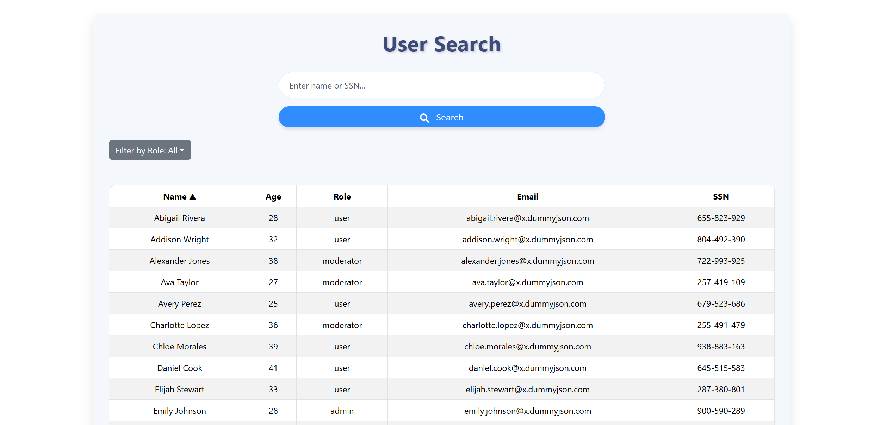

# User Search 

This project is a React-based application that provides a user-friendly interface to search, filter, and sort user data. It includes features such as querying user data, role-based filtering, and column sorting. The UI is built using React-Bootstrap.

## Features

- **Search:**  
  Search for users by name or SSN using an input field.

- **Filter by Role:**  
  Filter users based on their roles (Admin, User, Moderator, or All).

- **Sorting:**  
  Sort users by columns (Name, Age, Role, Email, SSN) in ascending or descending order.

- **Responsive Design:**  
  Fully responsive and styled using Bootstrap for a clean and modern look.

## Technologies Used

- **React:**  
  Core library for building the user interface.

- **React-Bootstrap:**  
  For styling and responsive design.

- **Axios:**  
  For making API requests.

- **React Icons:**  
  To enhance the UI with icons.

## Getting Started

### Prerequisites
Make sure you have the following installed on your system:

- Node.js (>=14.x)
- npm (>=6.x)

### Installation

1. Navigate to the project directory and install the dependencies:
    ```bash
    npm install
    ```

2. Start the development server:
    ```bash
    npm start
    ```

3. Open the application in your browser at [http://localhost:3000](http://localhost:3000).

## API Endpoint
The application communicates with the backend through the following API:

- **GET** `http://localhost:8080/api/users/search`
  - **Parameters:**
    - `query` (string): The search term for querying users.
  - **Response:**
    ```json
    [
      {
        "id": 1,
        "firstName": "John",
        "lastName": "Doe",
        "age": 30,
        "role": "admin",
        "email": "john.doe@example.com",
        "ssn": "123-45-6789"
      }
    ]
    ```

## Screenshots


  